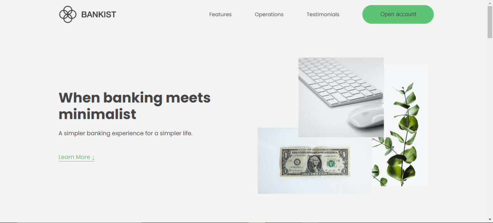

<h1 align="center">Bankist</h1>

The "Bankist" project is a web application that aims to provide a modern banking experience. There is a "Testimonials" section on the site where users share their experiences. In addition, there is the "Operations" section, which describes the operational processes of the bank, and the "Features" section, which details the features offered. There is also an "Account Opening" section that makes opening new accounts quick and easy. The project has been developed using React so users can have a more interactive and user-friendly experience.

<h2>🍿 Features </h2>
<ul>   
   <li>Open account</li>
   <li>Responsive</li>
</ul>

<h2>🍿 Technologies </h2>
<ul>
   <li>ReactJs</li>
   <li>SwiperJs</li>
</ul>

<h2>🍿 How to Run the Website on Your System </h2>
<h3> Step 1: Download and Extract the Code </h3>

First, download the entire website code and extract the ZIP file to a folder on your local system.

<h4>Website Code: https://github.com/BilgeGates/Bankist-Page.git</h4>
<h3>Step 2: Run the Website
</h3>

Open your code editor (such as VS Code) and navigate to the project directory. Then, open a terminal and run the following command:
pnpm run dev

This will start the application. Open a web browser and navigate to http://localhost:5173 to access the website.

<h2>🍿 Demo </h2>

 - Check out our live demo at https://bankist-demo-page.netlify.app/ 

